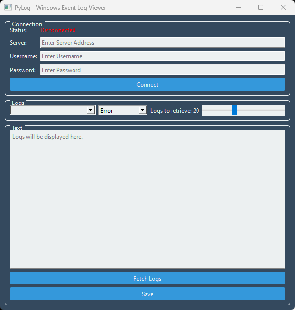

  # PyLog 📝 
  Windows event log retrieval and viewer.  
  
  ## Get Started 🚀  
  To get started, download the source code, or the standalone EXE and run it.  
  
  ## License 🔥  
  MIT license
      
  ## Screenshot ✨  
  
  